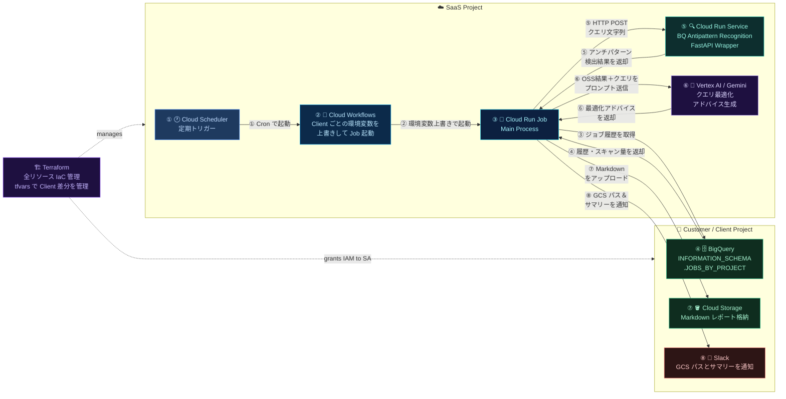

# Gemini BQ Query Analyzer

BigQueryの `INFORMATION_SCHEMA` からワーストクエリを抽出し、Geminiを使ってコスト・パフォーマンスの最適化案を自動生成・通知するツールです。

## 📖 目次

- [🏗️ アーキテクチャ図](#%EF%B8%8F-%E3%82%A2%E3%83%BC%E3%82%AD%E3%83%86%E3%82%AF%E3%83%81%E3%83%A3%E5%9B%B3)
- [📁 ディレクトリ構成](#-%E3%83%87%E3%82%A3%E3%83%AC%E3%82%AF%E3%83%88%E3%83%AA%E6%A7%8B%E6%88%90)
- [🛑 前提条件](#-%E5%89%8D%E6%8F%90%E6%9D%A1%E4%BB%B6)
- [🛠 開発・運用コマンド（Make）](#-%E9%96%8B%E7%99%BA%E9%81%8B%E7%94%A8%E3%82%B3%E3%83%9E%E3%83%B3%E3%83%89make)
- [☁️ 環境構築](#%EF%B8%8F-%E7%92%B0%E5%A2%83%E6%A7%8B%E7%AF%89)
- [Terraformによる構築（推奨）](#terraform%E3%81%AB%E3%82%88%E3%82%8B%E6%A7%8B%E7%AF%89%E6%8E%A8%E5%A5%A8)
- [gcloudによる手動構築](#gcloud%E3%81%AB%E3%82%88%E3%82%8B%E6%89%8B%E5%8B%95%E6%A7%8B%E7%AF%89)
- [💡 使い方](#-%E4%BD%BF%E3%81%84%E6%96%B9)
- [自動実行](#%E8%87%AA%E5%8B%95%E5%AE%9F%E8%A1%8C)
- [手動実行](#%E6%89%8B%E5%8B%95%E5%AE%9F%E8%A1%8C)
- [実行結果](#%E5%AE%9F%E8%A1%8C%E7%B5%90%E6%9E%9C)
- [🗑️ 環境破棄](#%EF%B8%8F-%E7%92%B0%E5%A2%83%E7%A0%B4%E6%A3%84)

## 🏗️ アーキテクチャ図



## 📁 ディレクトリ構成

- `base_config.ini`: SaaS プロジェクト ID・リージョン・GCS バケット名を定義する基本設定（**Git 管理**）。`generate_configs.py` と `ensure_state_bucket.py` がこれを参照する。
- `pyproject.toml` / `uv.lock`: 管理ツールの Python 依存を固定（`make install` = `uv sync`）。
- `.terraform-version`: tfenv 用に Terraform バージョンを固定（`1.15.7`）。
- **生成物（Git 除外）**: `env.txt` / `terraform/terraform.tfvars` / `terraform/backend.tf` / `tenants.json` は CI またはツールが自動生成する。

```plaintext
gemini-bq-query-analyzer/ (Git リポジトリのルート)
├── Makefile                      # make install/setup/check/deploy 等の運用タスク
├── base_config.ini               # 基本設定（SaaSプロジェクトID・リージョン・バケット名）
├── pyproject.toml                # 管理ツールの依存定義（uv）
├── uv.lock                       # 依存のロック（再現性）
├── .terraform-version            # Terraform バージョン固定（tfenv, 1.15.7）
├── ruff.toml / .mdformat.toml    # lint / format 設定
├── env.txt                       # 生成物・ローカル環境変数（Git除外）
├── tenants.json                  # 生成物・テナント設定（Git除外）
├── .gitignore
│
├── .github/
│   └── workflows/
│      ├── ci.yml                 # push/PR で make lint + make test（品質ゲート）
│      └── deploy.yml             # 手動デプロイ（generate→ensure-bucket→terraform apply）
│
├── tools/                        # 管理用スクリプト
│   ├── setup.sh                  # 初回必須の gcloud 認証等を対話実行（make setup）
│   ├── check.sh                  # 環境が整っているか確認（make check）
│   ├── ensure_state_bucket.py    # backend(tfstate)バケットを冪等に作成・堅牢化・権限付与
│   ├── generate_template.py      # 空のテナント設定スプレッドシート(CSV/Excel)を生成
│   ├── generate_configs.py       # GCSからテナント設定を読み込み設定ファイルを生成
│   └── upload_tenants.py         # スプレッドシートをtenants.jsonに変換してGCSへアップロード
│
├── tests/                        # pytest（make test）
│
├── terraform/                    # インフラ定義
│   ├── main.tf / variables.tf / iam.tf / bigquery.tf / cloud_run_*.tf ...
│   ├── .terraform.lock.hcl       # プロバイダのロック（Git管理）
│   ├── terraform.tfvars          # 生成物（Git除外）
│   └── backend.tf                # 生成物（Git除外）
│
├── workflows/
│   └── analyzer_workflow.yaml    # 実行フロー（Job起動→完了待ち→Slack通知）
│
├── main-app/                     # 🔍 メインの分析ツール（Cloud Run Job）
│   ├── src/main.py               # メインスクリプト
│   ├── sql/                      # worst_ranking 等の分析SQL
│   ├── prompts/gemini_prompt.txt # Geminiプロンプト
│   ├── requirements.txt          # コンテナ用依存（vertexai, google-cloud-bigquery 等）
│   └── Dockerfile                # PythonベースのJob用コンテナ定義
│
└── bq-antipattern-api/           # ⚙️ 構文解析API（Cloud Run Service）
    ├── app.py                    # FastAPIなどのAPIコード
    ├── requirements.txt          # fastapi, uvicorn 等
    └── Dockerfile                # Java + Python 同居のService用コンテナ定義
```

______________________________________________________________________

## 🛑 前提条件

本ツールをセットアップする前に、お使いの環境が以下の要件を満たしていることを確認してください。

- **ローカルツール**:
  - **Google Cloud SDK**(`gcloud`) / **GNU Make**
  - **uv**（Python 依存管理。`make install` で `.venv` を構築）
  - **Terraform**（**tfenv** 経由を推奨。`.terraform-version` でバージョンを `1.15.7` に固定。`tfenv install` で導入）
- **Google Cloud SDK**: `gcloud` コマンドがインストールされ、認証済みであること。
- **Google Cloud プロジェクト**:
  - SaaS基盤をホストするためのGoogle Cloud プロジェクト（以下、SaaSプロジェクト）が準備されていること。
  - 分析対象の顧客プロジェクト（以下、顧客プロジェクト）が準備されていること。
- **顧客プロジェクトにおける権限**: ワークロード用サービスアカウント（`gemini-bq-query-analyzer-sa`）に対して、顧客プロジェクト側で以下のIAMロールが付与されていること。
  - `BigQuery メタデータ閲覧者`
  - `BigQuery リソース閲覧者`
  - `Storage オブジェクト管理者` （分析レポートを格納するGCSバケットに対して）
- **プロンプトとコードの整合性**: `main-app/prompts/gemini_prompt.txt` 内の変数（例: `{query}`）が、`main-app/src/main.py` で定義される辞書のキーと一致していること。

______________________________________________________________________

## 🛠 開発・運用コマンド（Make）

日常の操作は `Makefile` に集約されています（`make help` で一覧表示）。

| ターゲット                  | 説明                                                                                                   |
| :-------------------------- | :----------------------------------------------------------------------------------------------------- |
| `make install`              | uv で `.venv` を作成し依存を同期（`uv sync`）。tfenv があれば `.terraform-version` の Terraform も導入 |
| `make setup`                | 初回必須の gcloud 認証・プロジェクト設定を対話実行                                                     |
| `make check`                | 環境確認（gcloud/terraform/認証/API/バケット/tenants.json）                                            |
| `make template`             | 空のテナント設定スプレッドシート(CSV/Excel)を生成                                                      |
| `make generate`             | GCS の `tenants.json` から `terraform.tfvars` / `backend.tf` / `env.txt` を生成                        |
| `make ensure-bucket`        | backend(tfstate)バケットを冪等に作成・堅牢化(versioning/UBLA/PAP)・deployer SA へ権限付与              |
| `make init`                 | `ensure-bucket` → `generate` → `terraform init`                                                        |
| `make format`               | ruff / terraform fmt / mdformat で一括整形（**書き込み**）                                             |
| `make lint`                 | 上記の**非破壊検査**（CI と同じゲート）                                                                |
| `make test`                 | pytest                                                                                                 |
| `make plan`                 | `terraform plan`                                                                                       |
| `make deploy`               | `terraform apply -auto-approve`（確認なし）                                                            |
| `make unlock` / `make lock` | 削除保護の解除 / 再有効化（`allow_destroy`）                                                           |
| `make destroy`              | `terraform destroy`（事前に `make unlock` が必要）                                                     |
| `make clean`                | 生成された設定ファイルを削除（tfstate / `.venv` は保持）                                               |

### ローカル開発フロー

```bash
make install     # .venv + 依存 + terraform を用意
make setup       # gcloud 認証（初回のみ）
make check       # 環境が整っているか確認
make format      # コミット前に整形
make lint test   # 検査とテスト
```

### CI/CD

- **`ci.yml`**: push / PR で `make lint` + `make test` を実行する品質ゲート（クラウド認証不要）。
- **`deploy.yml`**: 手動実行（Manual Deploy）で `ensure_state_bucket.py` → `generate_configs.py` → `terraform apply` を実行。Python 依存は `uv sync --no-dev` で `uv.lock` から導入。

> [!NOTE]
> `make deploy` / `make init` を実行すると、`base_config.ini` で指定した tfstate バケットが存在しない場合は自動で作成・堅牢化されます（手動でのバケット作成は不要）。

______________________________________________________________________

## ☁️ 環境構築

### Terraformによる構築（推奨）

> [!NOTE]
> 以下は SaaS 基盤の**初回ブートストラップ**手順です（サービスアカウント・WIF・api-jar バケット・Secret 等、Terraform 管理外の前提を作る）。
> 一度ブートストラップが済んだ後の通常運用では、**tfstate バケットの作成・権限付与・設定生成・デプロイは `make deploy` に集約**されています（手順 3〜4 の tfstate バケット手動作成は `ensure_state_bucket.py` が代替）。

#### 1. gcloud SDKの認証

```bash
gcloud auth login
gcloud auth application-default login
gcloud config set project <saas_project_id>
```

#### 2. Project IDを`base_config.ini`ファイルに設定

```bash
# 環境変数設定
sed -i '' "s/<saas_project_id>/$(gcloud config get-value project)/g" base_config.ini
```

#### 3. GCSバケットを作成

\# tfstateファイル格納用

```bash
export $(grep -v '^\[.*\]' base_config.ini | sed 's/ *= */=/g' | xargs)

# 1. ランダムな4桁のサフィックスを生成
RANDOM_SUFFIX=$(LC_ALL=C tr -dc 'a-z0-9' < /dev/urandom | head -c 4)

# 2. 新しいバケット名を決定
NEW_TFSTATE_BUCKET="gemini-bq-analyzer-tfstate-${saas_project_id}-${RANDOM_SUFFIX}"
echo "✨ 新しいtfstateバケット名: ${NEW_TFSTATE_BUCKET}"

# 3. バケットを作成
gcloud storage buckets create "gs://${NEW_TFSTATE_BUCKET}" \
    --project=${saas_project_id} \
    --location=${region}
```

\# BigQuery Antipattern Recognitionツール格納用

```bash
# 1. ランダムな4桁のサフィックスを生成
RANDOM_SUFFIX=$(LC_ALL=C tr -dc 'a-z0-9' < /dev/urandom | head -c 4)

# 2. 新しいバケット名を決定
NEW_API_JAR_BUCKET="gemini-bq-analyzer-api-jar-${saas_project_id}-${RANDOM_SUFFIX}"
echo "✨ 新しいtfstateバケット名: ${NEW_API_JAR_BUCKET}"

# 3. バケットを作成
gcloud storage buckets create "gs://${NEW_API_JAR_BUCKET}" \
    --project=${saas_project_id} \
    --location=${region}
```

#### 4. GCSバケット名を`base_config.ini`ファイルに設定

```bash
# tfstateバケット名
echo $NEW_TFSTATE_BUCKET
sed -i '' "s/<tfstate_bucket_name>/${NEW_TFSTATE_BUCKET}/g" base_config.ini

# api-jarバケット名
echo $NEW_API_JAR_BUCKET
sed -i '' "s/<api_jar_bucket_name>/${NEW_API_JAR_BUCKET}/g" base_config.ini

# 3. 置換結果の確認
cat base_config.ini

# 4. 更新をGithubにpush
git add base_config.ini
git push origin main
```

#### 5. BigQuery Antipattern Recognitionツールをダウンロード

- [Github](https://github.com/GoogleCloudPlatform/bigquery-antipattern-recognition/releases)から`bigquery-antipattern-recognition.jar`をダウンロード
- ローカルで実行することも考慮して`bq-antipattern-api/`に`bigquery-antipattern-recognition.jar`を配置

#### 6. BigQuery Antipattern RecognitionツールをGCSへ格納

```bash
gcloud storage cp bq-antipattern-api/bigquery-antipattern-recognition.jar gs://${NEW_API_JAR_BUCKET}/
```

#### 7. Terraformのサービスアカウント作成

```bash
# ワークロード実行用
gcloud iam service-accounts create gemini-bq-query-analyzer-sa \
    --display-name="Gemini Query Analyzer Service Account" \
    --project=${saas_project_id}

# Terraform デプロイ用
gcloud iam service-accounts create terraform-deployer-sa \
    --display-name="Terraform SaaS Infrastructure Manager" \
    --project=${saas_project_id}
```

#### 8. ワークロードサービスアカウントに顧客側の権限付与

\# ワークロード用サービスアカウントに必要なIAMロール

| 行番号 | 表示名                     | ロール識別子                  | 利用目的                                  |
| :----- | :------------------------- | :---------------------------- | :---------------------------------------- |
| 1      | BigQuery メタデータ閲覧者  | roles/bigquery.metadataViewer | 改善対象のテーブルのスキーマ等を読み取り  |
| 2      | BigQuery リソース閲覧者    | roles/bigquery.resourceViewer | INFOMATION_SCHEMAからジョブ履歴の読み取り |
| 3      | Storage オブジェクト管理者 | roles/storage.objectAdmin     | 診断レポートをGCSバケットへ納品           |

```bash
CUSTOMER_GCS_BUCKET_NAME=""
CUSTOMER_PROJECT_ID=""
CUSTOMER_ROLES=(
    "roles/bigquery.metadataViewer"
    "roles/bigquery.resourceViewer"
)
SA_EMAIL="gemini-bq-query-analyzer-sa@${saas_project_id}.iam.gserviceaccount.com"

for ROLE in ${CUSTOMER_ROLES[@]}; do
    gcloud projects add-iam-policy-binding $CUSTOMER_PROJECT_ID \
        --member="serviceAccount:${SA_EMAIL}" \
        --role="$ROLE" \
        --condition=None
done

gcloud storage buckets add-iam-policy-binding "gs://${CUSTOMER_GCS_BUCKET_NAME}" \
    --member="serviceAccount:${SA_EMAIL}" \
    --role="roles/storage.objectAdmin" \
    --quiet
```

#### 9.Terraform実行用のサービスアカウントにIAMロール付与

\# Terraform実行用サービスアカウントに必要なIAMロール

| 行番号 | 表示名                       | ロール識別子                          | 利用目的                                                      |
| :----- | :--------------------------- | :------------------------------------ | :------------------------------------------------------------ |
| 1      | Artifact Registry 管理者     | roles/artifactregistry.admin          | Dockerリポジトリの作成および削除                              |
| 2      | BigQuery データ管理者        | roles/bigquery.dataOwner              | BigQueryのデータセットとテーブルを作成および削除              |
| 3      | BigQuery ジョブユーザー      | roles/bigquery.jobUser                | BigQueryのテーブル読み取り,DDL実行                            |
| 4      | Cloud Build 編集者           | roles/cloudbuild.builds.editor        | Cloud Build を実行する権限                                    |
| 5      | Cloud Run 開発者             | roles/run.developer                   | Cloud Runサービスやジョブの作成および削除                     |
| 6      | Project IAM 管理者           | roles/resourcemanager.projectIamAdmin | IAMロールを付与する権限                                       |
| 7      | Service Usage Admin          | roles/serviceusage.serviceUsageAdmin  | APIを有効化                                                   |
| 8      | サービス アカウント ユーザー | roles/iam.serviceAccountUser          | Cloud Buildの実行,Workflowsへの紐付け                         |
| 9      | サービス アカウント 管理者   | roles/iam.serviceAccountAdmin         | サービスアカウント作成および削除                              |
| 10     | Storage 管理者               | roles/storage.Admin                   | tfstateファイルを格納するBackendバケットに書き込み            |
| 11     | Cloud Scheduler 管理者       | roles/cloudscheduler.admin            | ジョブの作成および削除                                        |
| 12     | Workflows 編集者             | roles/workflows.editor                | workflowの作成および削除                                      |
| 13     | 閲覧者                       | roles/viewer                          | Secret ManagerのSlack Webhook URLの確認, ビルドログの確認など |

```bash
ROLES=(
    "roles/artifactregistry.admin"
    "roles/bigquery.dataOwner"
    "roles/bigquery.jobUser"
    "roles/cloudbuild.builds.editor"
    "roles/run.developer"
    "roles/resourcemanager.projectIamAdmin"
    "roles/serviceusage.serviceUsageAdmin"
    "roles/iam.serviceAccountUser"
    "roles/iam.serviceAccountAdmin"
    "roles/storage.admin"
    "roles/cloudscheduler.admin"
    "roles/workflows.editor"
    "roles/viewer"
)

SA_EMAIL="terraform-deployer-sa@${saas_project_id}.iam.gserviceaccount.com"

# ループによる権限付与の実行
echo "Starting IAM policy binding for ${SA_EMAIL} in project ${saas_project_id}..."

for ROLE in "${ROLES[@]}"; do
    echo "Adding role: ${ROLE}"
    gcloud projects add-iam-policy-binding "${saas_project_id}" \
        --member="serviceAccount:${SA_EMAIL}" \
        --role="${ROLE}" \
        --no-user-output-enabled
done

echo "IAM policy binding completed."
```

#### 10. Workload Identity Poolの設定

GitHub ActionsからサービスアカウントキーなしでGCPへ認証するために、Workload Identity FederationのPoolとProviderを作成します。

```bash
GITHUB_REPO=""

# Workload Identity Pool作成
gcloud iam workload-identity-pools create "github-actions-pool" \
    --project="${saas_project_id}" \
    --location="global" \
    --display-name="GitHub Actions Pool"

# Workload Identity Provider作成（GitHubのOIDC設定）
gcloud iam workload-identity-pools providers create-oidc "github-provider" \
    --project="${saas_project_id}" \
    --location="global" \
    --workload-identity-pool="github-actions-pool" \
    --display-name="GitHub Provider" \
    --attribute-mapping="google.subject=assertion.sub,attribute.repository=assertion.repository,attribute.actor=assertion.actor" \
    --attribute-condition="assertion.repository == '${GITHUB_REPO}'" \
    --issuer-uri="https://token.actions.githubusercontent.com"

# PoolのリソースIDを取得
WIF_POOL=$(gcloud iam workload-identity-pools describe "github-actions-pool" \
    --project="${saas_project_id}" \
    --location="global" \
    --format="value(name)")

# ProviderのリソースIDを取得（GitHub Actions Secretに登録する値）
WIF_PROVIDER=$(gcloud iam workload-identity-pools providers describe "github-provider" \
    --project="${saas_project_id}" \
    --location="global" \
    --workload-identity-pool="github-actions-pool" \
    --format="value(name)")
echo "WIF_PROVIDER: ${WIF_PROVIDER}"

# このリポジトリのGitHub Actionsにのみトークン交換を許可
gcloud iam service-accounts add-iam-policy-binding \
    "terraform-deployer-sa@${saas_project_id}.iam.gserviceaccount.com" \
    --project="${saas_project_id}" \
    --role="roles/iam.workloadIdentityUser" \
    --member="principalSet://iam.googleapis.com/${WIF_POOL}/attribute.repository/${GITHUB_REPO}"
```

#### 11. Slack Webhook URLをSecret Managerに登録

Slack通知を使用するテナントごとに、Webhook URLをSecret Managerへ登録する。

**Slack側の手順：**

1. [Slack API](https://api.slack.com/apps) でアプリを作成（または既存アプリを選択）
1. **Incoming Webhooks** を有効化
1. 通知先チャンネルを選択し、Webhook URL（`https://hooks.slack.com/services/...`）を取得

**Secret Managerへの登録：**

```bash
WEBHOOK_URL="https://hooks.slack.com/services/<T_ID>/<B_ID>/<WEBHOOK_TOKEN>"
SECRET_NAME="slack-webhook-<tenant_id>"

gcloud secrets create ${SECRET_NAME} \
    --project=${saas_project_id} \
    --replication-policy="automatic"

echo -n "${WEBHOOK_URL}" | gcloud secrets versions add ${SECRET_NAME} \
    --project=${saas_project_id} \
    --data-file=-
```

> [!NOTE]
> `tenants.json` の `slack_webhook_secret_name` に、ここで登録した `SECRET_NAME` を設定する。
> Slack通知が不要なテナントは `slack_webhook_secret_name` を空文字にすることで無効化できる。

#### 12. テナント設定ファイルをGCSにアップロード

下記の形式で `tenants.json` を作成し、tfstateバケットの `config/` 配下にアップロードする。

```json
{
  "<tenant_id>": {
    "customer_project_id": "<顧客のGCPプロジェクトID>",
    "gcs_bucket_name": "<レポート格納バケット名>",
    "worst_query_limit": "1",
    "time_range_interval": "1 DAY",
    "slack_webhook_secret_name": "<Secret ManagerのSecret名>",
    "scheduler_cron": "0 9 * * *"
  }
}
```

スプレッドシートで管理する場合は、まず `generate_template.py` で空のテンプレートを生成し、編集してから `upload_tenants.py` で変換・アップロードする。

```bash
# 1. 空のテンプレートを生成（.xlsx を指定すると Excel 形式で出力。既定は ./tenants_template.csv）
python tools/generate_template.py

# 2. 生成された tenants_template.csv を編集してテナント情報を記入
#    列: tenant_id, customer_project_id, gcs_bucket_name, worst_query_limit,
#        time_range_interval, slack_webhook_secret_name, scheduler_cron

# 3. CSV または Excel から変換してGCSへアップロード（依存は make install で導入済み）
uv run python tools/upload_tenants.py tenants_template.csv
```

> [!NOTE]
> `upload_tenants.py` は空欄の列にデフォルト値を補完する（`worst_query_limit`=1, `time_range_interval`=1 DAY, `scheduler_cron`=0 9 * * \*, `slack_webhook_secret_name`=空）。

手動でJSONを作成する場合はGCSへ直接アップロードする。

```bash
gcloud storage cp tenants.json gs://${NEW_TFSTATE_BUCKET}/config/tenants.json
```

> [!NOTE]
> `gcs_bucket_name` は予め顧客に作成してもらいバケット名を確認すること。

#### 13. Github ActionsのSercretを登録

Setteings > Secrets and variables > Actions > New repositry secret

- WIF_PROVIDER: Workload Identity ProviderのリソースID（手順10で出力した `WIF_PROVIDER` の値）
  - 例: `projects/PROJECT_NUMBER/locations/global/workloadIdentityPools/github-actions-pool/providers/github-provider`
- SERVICE_ACCOUNT: Terraform実行用サービスアカウントのメールアドレス
  - 例: `terraform-deployer-sa@${saas_project_id}.iam.gserviceaccount.com`

#### 14. Github Actionsの手動実行

- GitHub リポジトリの Actions タブに移動
- 左側のメニューから **Manual Deploy** を選択
- `main`ブランチを選択し、Run workflow ボタンをクリックして実行
  - `terraform apply`まで実行される

#### 15. 生成ファイルの確認とダウンロード

Manual Deploy from Spreadsheet > Summary > deployment-configs > ↓

出力例:
\# env.txt

```bash
# ==========================================
# 共通設定 (SaaS 基盤側)
# ==========================================
SAAS_PROJECT_ID=<saas_project_id>
REGION="us-central1"
API_JAR_BUCKET=<api_jar_bucket_name>

# ==========================================
# マルチテナント設定 (JSON 形式)
# ==========================================
TENANTS_JSON='{
  "tenant1": {
    "customer_project_id": "tenant1_project_id",
    "gcs_bucket_name": "gemini-query-analyzer-reports",
    "worst_query_limit": "1",
    "time_range_interval": "1 DAY",
    "slack_webhook_secret_name": "",
    "scheduler_cron": "0 9 * * *"
  },
  "tenant2": {
    "customer_project_id": "tenant2_project_id",
    "gcs_bucket_name": "gemini-query-analyzer-reports",
    "worst_query_limit": "1",
    "time_range_interval": "2 DAY",
    "slack_webhook_secret_name": "",
    "scheduler_cron": "0 10 * * *"
  }
}'
```

\# terraform.tfvars

```bash
# Generated by generate_tfvars.py - DO NOT EDIT MANUALLY
# ==========================================
# 共通設定 (SaaS 基盤側)
# ==========================================
saas_project_id     = "<saas_project_id>"
region              = "us-central1"
api_jar_bucket_name = "<api_jar_bucket_name>"

# ==========================================
# マルチテナント設定 (マップ 形式)
# ==========================================
tenants = {
  "pacific-legend" = {
    customer_project_id       = "tenant-1"
    gcs_bucket_name           = "gemini-query-analyzer-reports"
    worst_query_limit         = "1"
    time_range_interval       = "2 DAY"
    slack_webhook_secret_name = ""
    scheduler_cron            = "0 9 * * *"
  }
  "datatechlab" = {
    customer_project_id       = "tenant-2"
    gcs_bucket_name           = "gemini-query-analyzer-reports"
    worst_query_limit         = "1"
    time_range_interval       = "2 DAY"
    slack_webhook_secret_name = ""
    scheduler_cron            = "0 10 * * *"
  }
}
```

\# backend.tf

```bash
# Generated from base_config.ini - DO NOT EDIT
terraform {
  backend "gcs" {
    bucket = "<NEW_TFSTATE_BUCKET>"
    prefix = "terraform/state"
  }
}
```

______________________________________________________________________

### gcloudによる手動構築

#### 1. SaaSプロジェクトのAPIの有効化

```bash
gcloud services enable \
    aiplatform.googleapis.com \
    run.googleapis.com \
    cloudbuild.googleapis.com \
    bigquery.googleapis.com \
    cloudscheduler.googleapis.com \
    iam.googleapis.com \
    iamcredentials.googleapis.com \
    sts.googleapis.com \
    storage.googleapis.com \
    workflows.googleapis.com \
    artifactregistry.googleapis.com \
    secretmanager.googleapis.com
```

#### 2. 環境設定ファイルを配置

```bash
cd Downloads/deployment-configs
cp env.txt ~/gemini-bq-query-analyzer/
```

#### 3. SaaSプロジェクトにサービスアカウントの作成

```bash
# .envファイルから変数を読み込む
set -a
source env.txt
set +a

# サービスアカウントの名前とメールアドレスを定義
SA_NAME="gemini-bq-query-analyzer-sa"
SA_EMAIL="${SA_NAME}@${SAAS_PROJECT_ID}.iam.gserviceaccount.com"
echo $SA_EMAIL

gcloud iam service-accounts create ${SA_NAME} \
    --display-name="Gemini Query Analyzer Service Account" \
    --project=${SAAS_PROJECT_ID}
```

#### 4. SaaSプロジェクトにIAMロールの設定

```bash
# ==========================================
# SaaSプロジェクト側への権限付与（実行基盤）
# ==========================================
SAAS_ROLES=(
    "roles/aiplatform.user"
    "roles/bigquery.jobUser"
    "roles/bigquery.dataViewer"
    "roles/workflows.invoker"
    "roles/secretmanager.secretAccessor"
    "roles/run.developer"
    "roles/logging.logWriter"
)
# "roles/aiplatform.user"              # Gemini (Vertex AI) の実行権限
# "roles/bigquery.jobUser"             # Saasプロジェクトでジョブ実行権限（ドライラン実行)
# "roles/bigquery.dataViewer"          # masterテーブルを閲覧する権限
# "roles/workflows.invoker"            # workflowsの起動
# "roles/secretmanager.secretAccessor" # Secret ManagerからSlack Webhook URLの取得
# "roles/run.developer"                # cloud run service(api)とJobの呼び出し, workflowsから環境変数セット
# "roles/logging.logWriter"            # Cloud Runなどからログ書き出し

for ROLE in ${SAAS_ROLES[@]}; do
    echo $ROLE
done

for ROLE in ${SAAS_ROLES[@]}; do
    gcloud projects add-iam-policy-binding ${SAAS_PROJECT_ID} \
        --member="serviceAccount:${SA_EMAIL}" \
        --role="$ROLE" \
        --condition=None
done
```

#### 5. bq-antipattern-apiのデプロイ

[注意]Cloud Run Serviceのデプロイ手順は`bq-antipattern-api/README.md`をご確認ください。

#### 6. bq-antipattern-apiのURLを取得

```bash
# デプロイされたURLを環境変数に格納（後続のJob作成で使用）
BQ_ANTIPATTERN_API_URL=$(
  gcloud run services describe bq-antipattern-api \
    --region="${REGION}" \
    --project="${SAAS_PROJECT_ID}" \
    --format="value(status.url)"
)

echo "API URL: ${BQ_ANTIPATTERN_API_URL}"
```

#### 7. masterデータセット作成 & masterデータ投入

```bash
# データセットの作成
bq mk --location=${REGION} --project_id=${SAAS_PROJECT_ID} audit_master

# テーブル作成とデータ投入 (SQL内のプレースホルダーを置換して実行)
sed "s/<saas_project_id>/${SAAS_PROJECT_ID}/g" main-app/sql/antipattern-list.sql | \
bq query --use_legacy_sql=false --project_id=${SAAS_PROJECT_ID}
```

#### 8. 顧客プロジェクトにIAMロール付与 & レポート保存用のバケット作成

```bash
# ==========================================
# 顧客プロジェクト側への権限付付与（分析対象） & GCSバケットへ権限付与
# ==========================================
CUSTOMER_ROLES=(
    "roles/bigquery.metadataViewer"
    "roles/bigquery.resourceViewer"
)
# "roles/bigquery.metadataViewer" # 各テーブルのスキーマやパーティション構成を取得
# "roles/bigquery.resourceViewer" # INFORMATION_SCHEMA.JOBS からプロジェクト全体のクエリ履歴を取得

# 2. jq を使ってテナントのキー（pacific-legend, datatechlab）のリストを取得しループ
for TENANT_KEY in $(echo "$TENANTS_JSON" | jq -r 'keys[]'); do

    # 3. 各テナントの詳細情報を取得
    CUSTOMER_PROJECT_ID=$(echo "$TENANTS_JSON" | jq -r ".\"$TENANT_KEY\".customer_project_id")
    GCS_BUCKET_NAME=$(echo "$TENANTS_JSON" | jq -r ".\"$TENANT_KEY\".gcs_bucket_name")

    echo "----------------------------------------"
    echo "Tenant: ${TENANT_KEY}"
    echo "Project: ${CUSTOMER_PROJECT_ID}"

    # 5. IAMロールを付与
    for ROLE in ${CUSTOMER_ROLES[@]}; do
        gcloud projects add-iam-policy-binding $CUSTOMER_PROJECT_ID \
            --member="serviceAccount:${SA_EMAIL}" \
            --role="$ROLE" \
            --condition=None
    done

    # 6. バケットへの権限付与 (Storage オブジェクト管理者)
    echo "[2/2] Adding IAM policy binding for Service Account..."
    gcloud storage buckets add-iam-policy-binding "gs://${GCS_BUCKET_NAME}" \
        --member="serviceAccount:${SA_EMAIL}" \
        --role="roles/storage.objectAdmin" \
        --quiet
done
```

#### 9. メイン分析ジョブ (gemini-bq-query-analyzer-job) の作成

```bash
cd main-app

gcloud run jobs deploy gemini-bq-query-analyzer-job \
    --source . \
    --region ${REGION} \
    --project ${SAAS_PROJECT_ID} \
    --service-account=${SA_EMAIL} \
    --max-retries 0 \
    --task-timeout 600s \
    --set-env-vars SAAS_PROJECT_ID=${SAAS_PROJECT_ID} \
    --set-env-vars BQ_ANTIPATTERN_API_URL=${BQ_ANTIPATTERN_API_URL} \
    --set-env-vars CUSTOMER_PROJECT_ID="" \
    --set-env-vars GCS_BUCKET_NAME="" \
    --set-env-vars WORST_QUERY_LIMIT="" \
    --set-env-vars TIME_RANGE_INTERVAL=""

    # --set-env-vars TIME_RANGE_START=${TIME_RANGE_START} \
    # --set-env-vars TIME_RANGE_END=${TIME_RANGE_END}
```

#### 10. Workflowsの設定

```bash
cd ../workflows

# YAML内の変数を環境変数で置換した一時ファイルを生成してデプロイ
cat analyzer_workflow.yaml | sed \
  -e 's/\$\${/${/g' \
  -e "s/\${project_id}/${SAAS_PROJECT_ID}/g" \
  -e "s/\${region}/${REGION}/g" \
  -e "s/\${job_name}/gemini-bq-query-analyzer-job/g" > processed_workflow.yaml

gcloud workflows deploy gemini-bq-query-analyzer-workflow \
    --source processed_workflow.yaml \
    --location $REGION \
    --project $SAAS_PROJECT_ID \
    --service-account=${SA_EMAIL}
```

#### 11. Cloud Schedulerの設定

```bash
# jqを使用してテナントごとにループ実行
for TENANT_KEY in $(echo "$TENANTS_JSON" | jq -r 'keys[]'); do

    # テナント情報の抽出
    CUSTOMER_PROJECT_ID=$(echo "$TENANTS_JSON" | jq -r ".\"$TENANT_KEY\".customer_project_id")
    BUCKET_NAME=$(echo "$TENANTS_JSON" | jq -r ".\"$TENANT_KEY\".gcs_bucket_name")
    WORST_LIMIT=$(echo "$TENANTS_JSON" | jq -r ".\"$TENANT_KEY\".worst_query_limit")
    INTERVAL=$(echo "$TENANTS_JSON" | jq -r ".\"$TENANT_KEY\".time_range_interval")
    WEBHOOK=$(echo "$TENANTS_JSON" | jq -r ".\"$TENANT_KEY\".slack_webhook_secret_name")
    CRON=$(echo "$TENANTS_JSON" | jq -r ".\"$TENANT_KEY\".scheduler_cron")

    # Workflowに渡す引数のJSONを構築
    ARGUMENT=$(jsonencode_args=$(jq -n \
        --arg tid "$TENANT_KEY" \
        --arg cpid "$CUSTOMER_PROJECT_ID" \
        --arg bkt "$BUCKET_NAME" \
        --arg limit "$WORST_LIMIT" \
        --arg interval "$INTERVAL" \
        --arg webhook "$WEBHOOK" \
        '{tenant_id: $tid, customer_project_id: $cpid, gcs_bucket_name: $bkt, worst_query_limit: $limit, time_range_interval: $interval, slack_webhook_secret_name: $webhook}')
        echo "{\"argument\": $(echo $jsonencode_args | jq -Rs .)}")

    # Schedulerジョブの作成
    gcloud scheduler jobs create http "gemini-bq-query-analyzer-scheduler-${TENANT_KEY}" \
        --project $SAAS_PROJECT_ID \
        --location $REGION \
        --schedule "$CRON" \
        --uri "https://workflowexecutions.googleapis.com/v1/projects/${SAAS_PROJECT_ID}/locations/${REGION}/workflows/gemini-bq-query-analyzer-workflow/executions" \
        --message-body "$ARGUMENT" \
        --oauth-service-account-email ${SA_EMAIL} \
        --time-zone "Asia/Tokyo"
done
```

## 💡 使い方

### 自動実行

環境構築が完了すると、ツールはCloud Schedulerによってテナントごとに定義されたスケジュール（`scheduler_cron`）で自動的に実行されます。

### 手動実行

特定のテナントに対して即時分析を実行したい場合は、以下の手順でCloud Workflowsを直接実行します。

1. **gcloudで認証します。**

   ```bash
   gcloud auth login
   gcloud config set project <SaaSプロジェクトID>
   ```

1. **Workflowsを実行します。**
   `<TENANT_ID>` を、`tenants.json` で定義した対象のテナントIDに置き換えてください。

   ```bash
   gcloud workflows run gemini-bq-query-analyzer-workflow --data='{"argument": "{\"tenant_id\": \"<TENANT_ID>\"}"}'
   ```

### 実行結果

処理が完了すると、指定したSlackチャンネルに以下のような通知が届きます。詳細な分析レポートは、通知に記載されたGCSリンクから確認できます。

> :sparkles: **BigQuery クエリ最適化レポート**
>
> プロジェクト `your-project-id` のためのBigQueryクエリ分析が完了しました。
>
> :bar_chart: **分析概要**
>
> - **分析対象期間:** 2024-01-01 00:00:00 UTC から 2024-01-02 00:00:00 UTC
> - **分析対象クエリ数:** 5
> - **レポートファイル:** [gs://your-bucket/report-20240102.md](https://console.cloud.google.com/storage/browser/your-bucket/report-20240102.md)
>
> **サマリー:**
> `SELECT`句でワイルドカード (`*`) を使用する代わりに、必要な列を明示的に指定してください。これにより、不要なデータのスキャンを避け、クエリのパフォーマンスが向上します。

## 🗑️ 環境破棄

削除保護フラグ `allow_destroy`（既定 `false`）があるため、破棄は 2 段階で行います。

### 1. 設定ファイルを用意

ローカルに `terraform/backend.tf` / `terraform.tfvars` が無い場合は、GCS の `tenants.json` から再生成します。

```bash
make generate
```

### 2. 削除保護を解除して破棄

```bash
make plan       # 破棄対象を事前確認（任意だが推奨）
make unlock     # allow_destroy=true を設定し apply（保護解除を反映）
make destroy    # terraform destroy（unlock 済みでないとゲートで拒否される）
```

> [!WARNING]
> `audit_master` データセットは `allow_destroy=true` のとき中身（マスタテーブル）ごと破棄されます。手動での `bq rm` は不要です。再び保護したい場合は `make lock` を実行してください。
