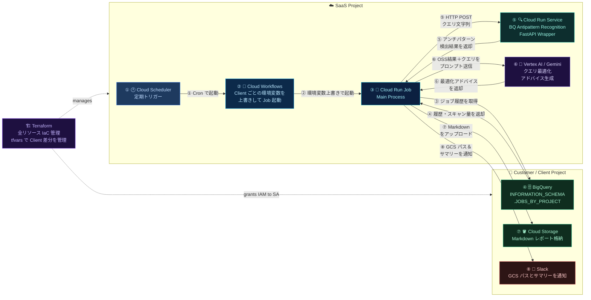

# Gemini BQ Query Analyzer

BigQueryの `INFORMATION_SCHEMA` からワーストクエリを抽出し、Geminiを使ってコスト・パフォーマンスの最適化案を自動生成・通知するツールです。

## 📖 目次

- [🏗️ アーキテクチャ図](#%EF%B8%8F-%E3%82%A2%E3%83%BC%E3%82%AD%E3%83%86%E3%82%AF%E3%83%81%E3%83%A3%E5%9B%B3)
- [📁 ディレクトリ構成](#-%E3%83%87%E3%82%A3%E3%83%AC%E3%82%AF%E3%83%88%E3%83%AA%E6%A7%8B%E6%88%90)
- [🛑 前提条件](#-%E5%89%8D%E6%8F%90%E6%9D%A1%E4%BB%B6)
- [🛠 開発・運用コマンド（Make）](#-%E9%96%8B%E7%99%BA%E9%81%8B%E7%94%A8%E3%82%B3%E3%83%9E%E3%83%B3%E3%83%89make)
- [☁️ 環境構築](#%EF%B8%8F-%E7%92%B0%E5%A2%83%E6%A7%8B%E7%AF%89)
- [Terraformによる構築（推奨）](#terraform%E3%81%AB%E3%82%88%E3%82%8B%E6%A7%8B%E7%AF%89%E6%8E%A8%E5%A5%A8)
- [gcloud による手動構築（別紙）](docs/manual-setup-gcloud.md)
- [💡 使い方](#-%E4%BD%BF%E3%81%84%E6%96%B9)
- [自動実行](#%E8%87%AA%E5%8B%95%E5%AE%9F%E8%A1%8C)
- [手動実行](#%E6%89%8B%E5%8B%95%E5%AE%9F%E8%A1%8C)
- [実行結果](#%E5%AE%9F%E8%A1%8C%E7%B5%90%E6%9E%9C)
- [🗑️ 環境破棄](#%EF%B8%8F-%E7%92%B0%E5%A2%83%E7%A0%B4%E6%A3%84)

## 🏗️ アーキテクチャ図



## 📁 ディレクトリ構成

- `base_config.ini`: SaaS プロジェクト ID・リージョン・GCS バケット名を定義する基本設定（**Git 管理**）。`generate_configs.py` と `ensure_state_bucket.py` がこれを参照する。
- `pyproject.toml` / `uv.lock`: 管理ツールの Python 依存を固定（`make install` = `uv sync`）。
- `.terraform-version`: tfenv 用に Terraform バージョンを固定（`1.15.7`）。
- **生成物（Git 除外）**: `env.txt` / `terraform/terraform.tfvars` / `terraform/backend.tf` / `tenants.json` は CI またはツールが自動生成する。

```plaintext
gemini-bq-query-analyzer/ (Git リポジトリのルート)
├── Makefile                      # make install/setup/check/deploy 等の運用タスク
├── base_config.ini               # 基本設定（SaaSプロジェクトID・リージョン・バケット名）
├── pyproject.toml                # 管理ツールの依存定義（uv）
├── uv.lock                       # 依存のロック（再現性）
├── .terraform-version            # Terraform バージョン固定（tfenv, 1.15.7）
├── ruff.toml / .mdformat.toml    # lint / format 設定
├── env.txt                       # 生成物・ローカル環境変数（Git除外）
├── tenants.json                  # 生成物・テナント設定（Git除外）
├── .gitignore
│
├── .github/
│   └── workflows/
│      ├── ci.yml                 # push/PR で make lint + make test（品質ゲート）
│      └── deploy.yml             # 手動デプロイ（generate→ensure-bucket→terraform apply）
│
├── tools/                        # 管理用スクリプト
│   ├── setup.sh                  # 初回必須の gcloud 認証等を対話実行（make setup）
│   ├── check.sh                  # 環境が整っているか確認（make check）
│   ├── ensure_state_bucket.py    # backend(tfstate)バケットを冪等に作成・堅牢化・権限付与
│   ├── generate_template.py      # 空のテナント設定スプレッドシート(CSV/Excel)を生成
│   ├── generate_configs.py       # GCSからテナント設定を読み込み設定ファイルを生成
│   └── upload_tenants.py         # スプレッドシートをtenants.jsonに変換してGCSへアップロード
│
├── tests/                        # pytest（make test）
│
├── docs/
│   └── manual-setup-gcloud.md    # gcloud のみで構築する詳細手順（別紙）
│
├── terraform/                    # インフラ定義
│   ├── main.tf / variables.tf / iam.tf / bigquery.tf / cloud_run_*.tf ...
│   ├── .terraform.lock.hcl       # プロバイダのロック（Git管理）
│   ├── terraform.tfvars          # 生成物（Git除外）
│   └── backend.tf                # 生成物（Git除外）
│
├── workflows/
│   └── analyzer_workflow.yaml    # 実行フロー（Job起動→完了待ち→Slack通知）
│
├── main-app/                     # 🔍 メインの分析ツール（Cloud Run Job）
│   ├── src/main.py               # メインスクリプト
│   ├── sql/                      # worst_ranking 等の分析SQL
│   ├── prompts/gemini_prompt.txt # Geminiプロンプト
│   ├── requirements.txt          # コンテナ用依存（vertexai, google-cloud-bigquery 等）
│   └── Dockerfile                # PythonベースのJob用コンテナ定義
│
└── bq-antipattern-api/           # ⚙️ 構文解析API（Cloud Run Service）
    ├── app.py                    # FastAPIなどのAPIコード
    ├── requirements.txt          # fastapi, uvicorn 等
    └── Dockerfile                # Java + Python 同居のService用コンテナ定義
```

______________________________________________________________________

## 🛑 前提条件

本ツールをセットアップする前に、お使いの環境が以下の要件を満たしていることを確認してください。

- **ローカルツール**:
  - **Google Cloud SDK**(`gcloud`) / **GNU Make**
  - **uv**（Python 依存管理。`make install` で `.venv` を構築）
  - **Terraform**（**tfenv** 経由を推奨。`.terraform-version` でバージョンを `1.15.7` に固定。`tfenv install` で導入）
- **Google Cloud SDK**: `gcloud` コマンドがインストールされ、認証済みであること。
- **Google Cloud プロジェクト**:
  - SaaS基盤をホストするためのGoogle Cloud プロジェクト（以下、SaaSプロジェクト）が準備されていること。
  - 分析対象の顧客プロジェクト（以下、顧客プロジェクト）が準備されていること。
- **顧客プロジェクトにおける権限**: ワークロード用サービスアカウント（`gemini-bq-query-analyzer-sa`）に対して、顧客プロジェクト側で以下のIAMロールが付与されていること。
  - `BigQuery メタデータ閲覧者`
  - `BigQuery リソース閲覧者`
  - `Storage オブジェクト管理者` （分析レポートを格納するGCSバケットに対して）
- **プロンプトとコードの整合性**: `main-app/prompts/gemini_prompt.txt` 内の変数（例: `{query}`）が、`main-app/src/main.py` で定義される辞書のキーと一致していること。

______________________________________________________________________

## 🛠 開発・運用コマンド（Make）

日常の操作は `Makefile` に集約されています（`make help` で一覧表示）。

| ターゲット                   | 説明                                                                                                                   |
| :--------------------------- | :--------------------------------------------------------------------------------------------------------------------- |
| `make help`                  | ターゲット一覧を表示（デフォルト）                                                                                     |
| `make install`               | uv で `.venv` を作成し依存を同期（`uv sync`）。tfenv があれば `.terraform-version` の Terraform も導入                 |
| `make setup`                 | gcloud 認証 + project id を `base_config.ini` に設定（対話）                                                           |
| `make bootstrap`             | 初回ブートストラップ（SA作成 / SaaS IAM / api-jarバケット+JAR / WIF）を冪等に作成。`GITHUB_REPO=owner/name` で上書き可 |
| `make github-secrets`        | GitHub Actions Secrets（`WIF_PROVIDER` / `SERVICE_ACCOUNT`）を `gh` で設定                                             |
| `make check`                 | 環境確認（gcloud/terraform/認証/API/バケット/tenants.json）                                                            |
| `make template`              | 空のテナント設定スプレッドシート(CSV/Excel)を生成                                                                      |
| `make upload-tenants`        | テナント設定を GCS へアップロード（`FILE=...`、既定 `tenants_template.csv`）                                           |
| `make secret`                | Slack Webhook を Secret Manager へ登録（`TENANT=<id> URL=<webhook>` 必須）                                             |
| `make generate`              | GCS の `tenants.json` から `terraform.tfvars` / `backend.tf` / `env.txt` を生成                                        |
| `make ensure-bucket`         | backend(tfstate)バケットを冪等に作成・堅牢化(versioning/UBLA/PAP)・deployer SA へ権限付与                              |
| `make ensure-bucket-dry-run` | `ensure-bucket` の変更内容を確認のみ（書き込みなし）                                                                   |
| `make init`                  | `ensure-bucket` → `generate` → `terraform init`                                                                        |
| `make format`                | ruff / terraform fmt / mdformat で一括整形（**書き込み**）                                                             |
| `make lint`                  | 上記の**非破壊検査**（CI と同じゲート）                                                                                |
| `make test`                  | pytest                                                                                                                 |
| `make plan`                  | `terraform plan`                                                                                                       |
| `make deploy`                | `terraform apply -auto-approve`（確認なし）                                                                            |
| `make unlock` / `make lock`  | 削除保護の解除 / 再有効化（`allow_destroy`）                                                                           |
| `make destroy`               | `terraform destroy`（事前に `make unlock` が必要）                                                                     |
| `make clean`                 | 生成された設定ファイルを削除（tfstate / `.venv` は保持）                                                               |

### ローカル開発フロー

```bash
make install     # .venv + 依存 + terraform を用意
make setup       # gcloud 認証（初回のみ）
make check       # 環境が整っているか確認
make format      # コミット前に整形
make lint test   # 検査とテスト
```

### CI/CD

- **`ci.yml`**: push / PR で `make lint` + `make test` を実行する品質ゲート（クラウド認証不要）。
- **`deploy.yml`**: 手動実行（Manual Deploy）で `ensure_state_bucket.py` → `generate_configs.py` → `terraform apply` を実行。Python 依存は `uv sync --no-dev` で `uv.lock` から導入。

> [!NOTE]
> `make deploy` / `make init` を実行すると、`base_config.ini` で指定した tfstate バケットが存在しない場合は自動で作成・堅牢化されます（手動でのバケット作成は不要）。

______________________________________________________________________

## ☁️ 環境構築

### Terraformによる構築（推奨）

ほぼ全ての操作が `make` で完結します。`gcloud` を直接叩く必要はありません（**顧客プロジェクト側の権限付与のみ手動**。手順 2 参照）。

#### 0. 前提

- `make install` 済み（uv + terraform）。
- `base_config.ini` の `region` を設定（`saas_project_id` は `make setup` で自動設定）。
- SaaS プロジェクトを用意。Slack 通知を使う場合は Incoming Webhook URL も用意。

#### 1. 認証とブートストラップ

```bash
make setup           # gcloud 認証 + project id を base_config.ini に設定
make bootstrap       # SA作成 / SaaS IAM / api-jarバケット+JAR / WIF を冪等に作成
make github-secrets  # WIF_PROVIDER / SERVICE_ACCOUNT を GitHub Secrets に設定
make check           # 環境が整っているか確認
```

> [!NOTE]
> `make bootstrap` は `GITHUB_REPO` を `git remote` から自動判定します。別リポジトリを指定する場合は `make bootstrap GITHUB_REPO=owner/name`。

#### 2. 顧客プロジェクト側の権限付与（手動・必須）

ワークロード用 SA `gemini-bq-query-analyzer-sa@<saas_project_id>.iam.gserviceaccount.com` に対し、**顧客プロジェクト側**で以下を付与します。顧客環境ごとに独立して実施する必要があり、Terraform / make の管理外です。

| ロール                          | 用途                                        |
| :------------------------------ | :------------------------------------------ |
| `roles/bigquery.metadataViewer` | テーブルのスキーマ / パーティション読み取り |
| `roles/bigquery.resourceViewer` | `INFORMATION_SCHEMA.JOBS` の読み取り        |
| `roles/storage.objectAdmin`     | レポート格納用 GCS バケットへの書き込み     |

```bash
SA_EMAIL="gemini-bq-query-analyzer-sa@<saas_project_id>.iam.gserviceaccount.com"
CUSTOMER_PROJECT_ID="<顧客プロジェクトID>"
CUSTOMER_GCS_BUCKET_NAME="<レポート格納バケット名>"   # 顧客が事前作成

for ROLE in roles/bigquery.metadataViewer roles/bigquery.resourceViewer; do
  gcloud projects add-iam-policy-binding "$CUSTOMER_PROJECT_ID" \
    --member="serviceAccount:${SA_EMAIL}" --role="$ROLE" --condition=None
done

gcloud storage buckets add-iam-policy-binding "gs://${CUSTOMER_GCS_BUCKET_NAME}" \
  --member="serviceAccount:${SA_EMAIL}" --role="roles/storage.objectAdmin" --quiet
```

#### 3. テナント設定

```bash
make template                                  # 空テンプレ(CSV)を生成
# tenants_template.csv を編集（1行=1テナント）
make upload-tenants FILE=tenants_template.csv  # tenants.json 化して GCS へ

# Slack 通知を使うテナントのみ: Secret を登録し、tenants の
# slack_webhook_secret_name に出力された Secret 名を設定する
make secret TENANT=<tenant_id> URL=<webhook_url>
```

#### 4. デプロイ

```bash
make deploy   # backend準備(ensure-bucket) → 設定生成(generate) → terraform apply
```

GitHub Actions の **Manual Deploy** からも実行できます（`main` ブランチで Run workflow）。CI は `make github-secrets` で設定した WIF で認証します。

______________________________________________________________________

### gcloud による手動構築（Terraform / CI を使わない場合）

`gcloud` のみで構築する詳細手順は別紙にまとめています。

➡ **[docs/manual-setup-gcloud.md](docs/manual-setup-gcloud.md)**

## 💡 使い方

### 自動実行

環境構築が完了すると、ツールはCloud Schedulerによってテナントごとに定義されたスケジュール（`scheduler_cron`）で自動的に実行されます。

### 手動実行

特定のテナントに対して即時分析を実行したい場合は、以下の手順でCloud Workflowsを直接実行します。

1. **gcloudで認証します。**

   ```bash
   gcloud auth login
   gcloud config set project <SaaSプロジェクトID>
   ```

1. **Workflowsを実行します。**
   `<TENANT_ID>` を、`tenants.json` で定義した対象のテナントIDに置き換えてください。

   ```bash
   gcloud workflows run gemini-bq-query-analyzer-workflow --data='{"argument": "{\"tenant_id\": \"<TENANT_ID>\"}"}'
   ```

### 実行結果

処理が完了すると、指定したSlackチャンネルに以下のような通知が届きます。詳細な分析レポートは、通知に記載されたGCSリンクから確認できます。

> :sparkles: **BigQuery クエリ最適化レポート**
>
> プロジェクト `your-project-id` のためのBigQueryクエリ分析が完了しました。
>
> :bar_chart: **分析概要**
>
> - **分析対象期間:** 2024-01-01 00:00:00 UTC から 2024-01-02 00:00:00 UTC
> - **分析対象クエリ数:** 5
> - **レポートファイル:** [gs://your-bucket/report-20240102.md](https://console.cloud.google.com/storage/browser/your-bucket/report-20240102.md)
>
> **サマリー:**
> `SELECT`句でワイルドカード (`*`) を使用する代わりに、必要な列を明示的に指定してください。これにより、不要なデータのスキャンを避け、クエリのパフォーマンスが向上します。

## 🗑️ 環境破棄

削除保護フラグ `allow_destroy`（既定 `false`）があるため、破棄は 2 段階で行います。

### 1. 設定ファイルを用意

ローカルに `terraform/backend.tf` / `terraform.tfvars` が無い場合は、GCS の `tenants.json` から再生成します。

```bash
make generate
```

### 2. 削除保護を解除して破棄

```bash
make plan       # 破棄対象を事前確認（任意だが推奨）
make unlock     # allow_destroy=true を設定し apply（保護解除を反映）
make destroy    # terraform destroy（unlock 済みでないとゲートで拒否される）
```

> [!WARNING]
> `audit_master` データセットは `allow_destroy=true` のとき中身（マスタテーブル）ごと破棄されます。手動での `bq rm` は不要です。再び保護したい場合は `make lock` を実行してください。
